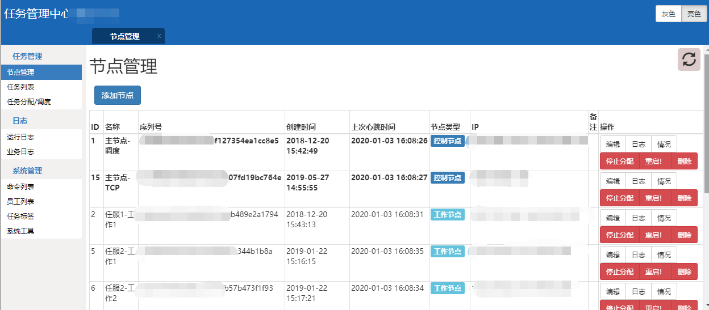
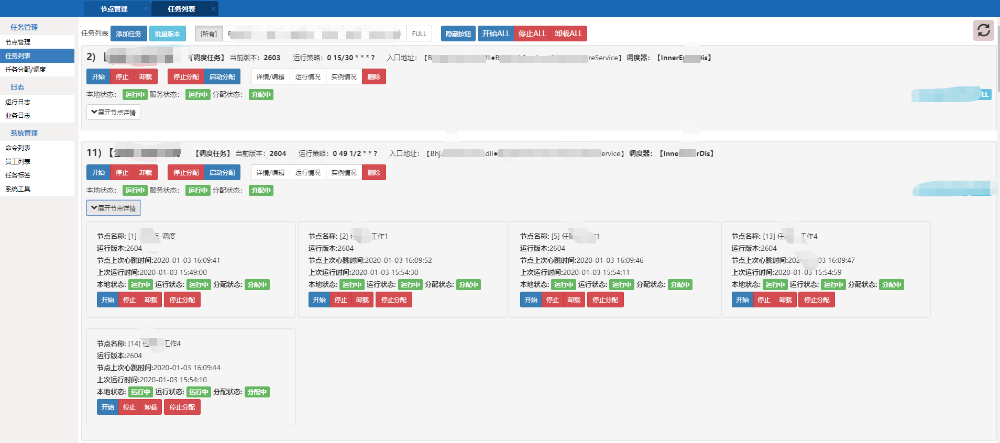

# ruanal

#### 介绍
基于C#开发的任务调度管理平台（寄宿于Windows）
管理平台为Asp.net mvc 网站
基于Quartz.Net开发，有周期行务、线程任务、调度任务三种类型
可动态加运行节点

#### 软件架构
asp.net MVC 
Windows Service
SqlServer

- 截图

- 组件结构

#### 安装教程

1.  建数据库 文件在DB目录下
2.  主Web架好 IIS，配好数据连接
3.  安装节点 主节点和工作节点 DispatchNode WorkNode ，是一个控制台程序，运行可以进行windows服务的安装 注意配置 web的址下和连接主节点的TCP
4.  在web管理台进行节点添加和任务添加
5.  应该差不多了

#### 使用说明
 

#### 参与贡献
 
交流：QQ 2323455412